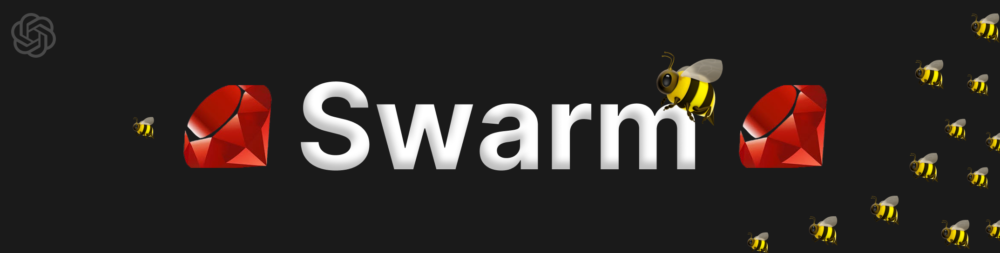

# Ruby OpenAI Swarm

[](https://rubygems.org/gems/ruby-openai-swarm)
[](https://github.com/graysonchen/ruby-openai-swarm/actions)

A Ruby-based educational framework adapted from OpenAI’s [Swarm](https://github.com/openai/swarm), exploring ergonomic, lightweight multi-agent orchestration.

> The primary goal of Swarm is to showcase the handoff & routines patterns explored in the [Orchestrating Agents: Handoffs & Routines](https://cookbook.openai.com/examples/orchestrating_agents) cookbook. It is not meant as a standalone library, and is primarily for educational purposes.

## Contents
- [Ruby OpenAI Swarm](#ruby-openai-swarm)
- [Table of Contents](#table-of-contents)
  - [Installation](#installation)
    - [Bundler](#bundler)
    - [Gem install](#gem-install)
  - [examples](#examples)
  - [Documentation](#documentation)

## Installation

### Bundler

Add this line to your application's Gemfile:

```ruby
gem "ruby-openai-swarm"
```

And then execute:

```bash
$ bundle install
```

### Gem install

Or install with:

```bash
$ gem install ruby-openai-swarm
```

and require with:

```ruby
require "ruby-openai-swarm"
```

## Usage

### With Config

For a more robust setup, you can configure the gem with your API keys, for example in an `openai.rb` initializer file. Never hardcode secrets into your codebase - instead use something like [dotenv](https://github.com/motdotla/dotenv) to pass the keys safely into your environments.

```ruby
OpenAI.configure do |config|
  config.access_token = ENV['OPENAI_ACCESS_TOKEN']
end
```

OR

```ruby
# https://openrouter.ai
OpenAI.configure do |config|
  config.access_token = ENV['OPEN_ROUTER_ACCESS_TOKEN']
  config.uri_base = "https://openrouter.ai/api/v1"
end
```

more see: https://github.com/alexrudall/ruby-openai/tree/main?tab=readme-ov-file#ollama

Then you can create a client like this:

```ruby
client = OpenAISwarm.new

def spanish_agent
  OpenAISwarm::Agent.new(
    name: "Spanish Agent",
    instructions: "You only speak Spanish.",
    model: "gpt-4o-mini"
  )
end

transfer_to_spanish_agent = OpenAISwarm::FunctionDescriptor.new(
  target_method: :spanish_agent,
  description: 'Transfer spanish speaking users immediately.'
)

english_agent = OpenAISwarm::Agent.new(
  name: "English Agent",
  instructions: "You only speak English.",
  model: "gpt-4o-mini",
  functions: [transfer_to_spanish_agent]
)

messages = [{"role": "user", "content": "Hola. ¿Como estás?"}]
response = client.run(agent: english_agent, messages: messages, debug: true)

pp response.messages.last
```

```ruby
{"role"=>"assistant",
 "content"=>"¡Hola! Estoy bien, gracias. ¿Y tú?",
 "refusal"=>nil,
 :sender=>"Spanish Agent"}
```

# Examples

Check out `/examples` for inspiration! Learn more about each one in its README.

- [X] [`basic`](examples/basic): Simple examples of fundamentals like setup, function calling, handoffs, and context variables
- [X] [`triage_agent`](examples/triage_agent): Simple example of setting up a basic triage step to hand off to the right agent
- [X] [`weather_agent`](examples/weather_agent): Simple example of function calling
- [ ] [`airline`](examples/airline): A multi-agent setup for handling different customer service requests in an airline context.
- [ ] [`support_bot`](examples/support_bot): A customer service bot which includes a user interface agent and a help center agent with several tools
- [ ] [`personal_shopper`](examples/personal_shopper): A personal shopping agent that can help with making sales and refunding orders

link: https://github.com/openai/swarm/tree/main?tab=readme-ov-file#examples

## Documentation


## Development

After checking out the repo, run `bin/setup` to install dependencies. Then, run `rake spec` to run the tests. You can also run `bin/console` for an interactive prompt that will allow you to experiment.

To install this gem onto your local machine, run `bundle exec rake install`. To release a new version, update the version number in `version.rb`, and then run `bundle exec rake release`, which will create a git tag for the version, push git commits and tags, and push the `.gem` file to [rubygems.org](https://rubygems.org).

## Contributing

Bug reports and pull requests are welcome on GitHub at https://github.com/graysonchen/ruby-openai-swarm. This project is intended to be a safe, welcoming space for collaboration, and contributors are expected to adhere to the [code of conduct](https://github.com/graysonchen/ruby-openai-swarm/blob/main/CODE_OF_CONDUCT.md).

## License

The gem is available as open source under the terms of the [MIT License](https://opensource.org/licenses/MIT).
